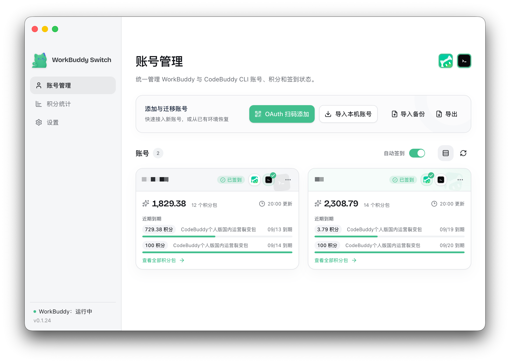
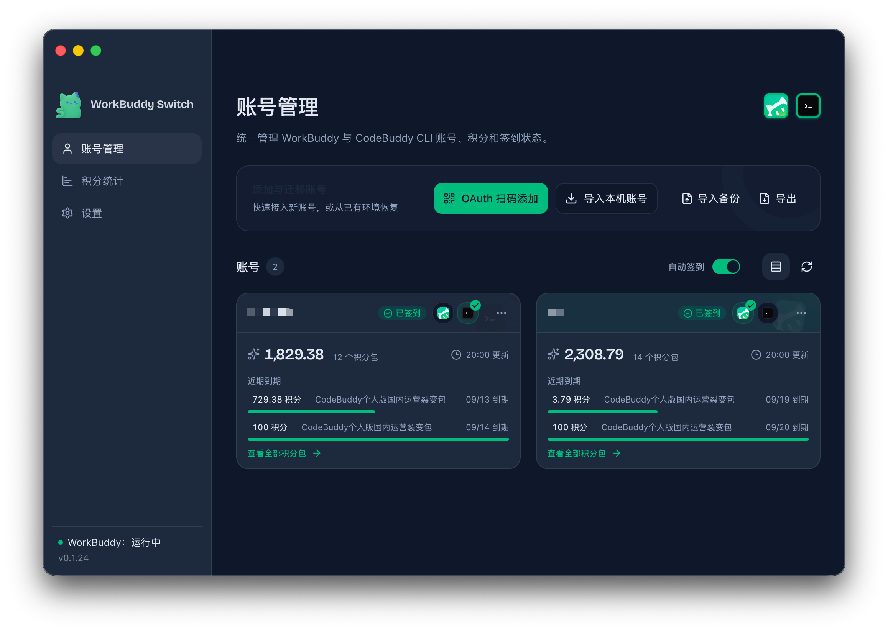
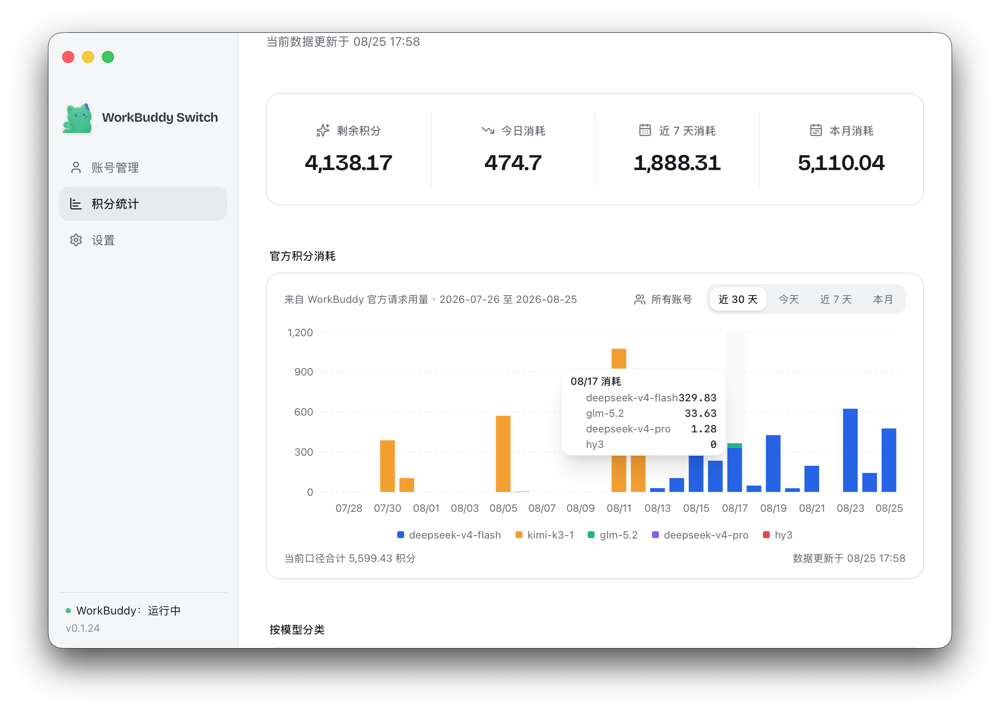
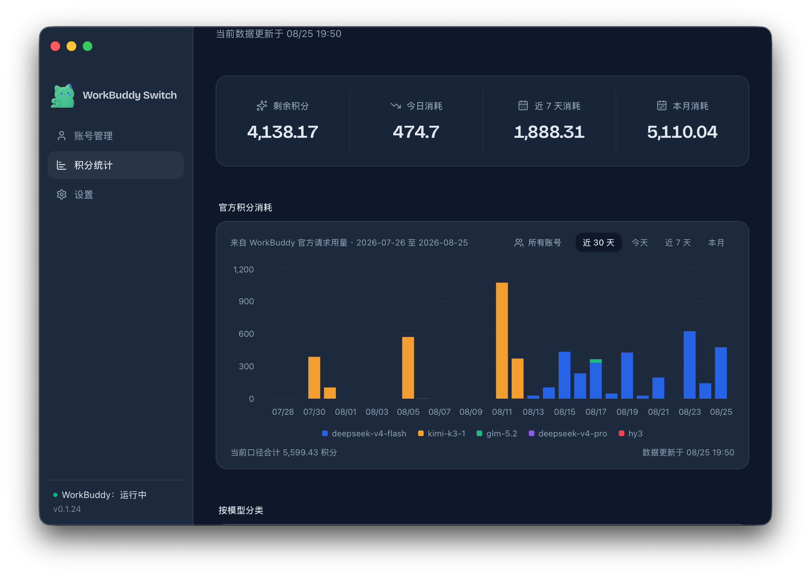

# workbuddy-switch

WorkBuddy / CodeBuddy CLI / CodeBuddy CN IDE 账号切换桌面 App（Tauri），支持积分到期监控与自动签到。

同时提供 npm / webui 版本，方便在浏览器中使用同一套账号管理能力。

- **桌面 App**：从 GitHub Releases 下载 macOS、Windows 或 Linux 安装包（Tauri，推荐日常使用）
- **npm / webui**：`npm i -g workbuddy-switch` 后运行 `workbuddy-switch`，浏览器打开操作界面

多账号共享登录态，一键切换 WorkBuddy 登录账号，并支持将当前账号的会话复制给目标账号（云端归属目标）。

<p align="center">
  
</p>

<p align="center">
  <strong>workbuddy-switch</strong><br />
  WorkBuddy / CodeBuddy CLI 账号切换工具
</p>


### 在线演示

[打开 GitHub Pages 在线演示](https://changexbc.github.io/workbuddy-switch/)（只读演示；账号、积分与请求记录均为虚构数据，所有业务操作均已禁用。）

## 快速开始

### npm 安装（webui）

```bash
npm i -g workbuddy-switch
workbuddy-switch              # 启动本地服务 + 自动打开浏览器
workbuddy-switch status       # 终端查看当前账号
```

webui 界面与桌面 App 一致：WorkBuddy / CodeBuddy CLI / CodeBuddy IDE 账号切换、积分到期监控、自动签到、会话复制、Token 统计与 token 保活。

### 桌面 App

前往 [GitHub Releases](https://github.com/changexbc/workbuddy-switch/releases/latest) 下载对应平台的安装包：

| 平台 | 安装包 | 安装方式 |
| --- | --- | --- |
| macOS Apple Silicon（M 系列，arm64） | `workbuddy-switch_<版本>_aarch64.dmg` | 打开 DMG，将 `workbuddy-switch.app` 拖入「应用程序」 |
| macOS Intel（x86_64） | `workbuddy-switch_<版本>_x86_64.dmg` | 打开 DMG，将 `workbuddy-switch.app` 拖入「应用程序」 |
| Windows x64 | `workbuddy-switch_<版本>_x64-setup.exe` | 运行安装程序并按提示完成安装 |
| Linux x64 | `workbuddy-switch_<版本>_amd64.deb` / `workbuddy-switch_<版本>_amd64.AppImage` | Debian/Ubuntu 安装 `.deb`；其他发行版可给 AppImage 添加执行权限后直接运行 |

macOS 首次启动若提示无法验证开发者，先在 Finder 中按住 Control 点击应用并选择「打开」，或前往「系统设置 → 隐私与安全性」选择「仍要打开」。仅当安装包来自上述官方 Releases、且系统仍提示「已损坏」时，再执行：

```bash
xattr -rd com.apple.quarantine "/Applications/workbuddy-switch.app"
```

应用能启动但切换账号时提示无权限，请参阅下方 [macOS 权限说明](#macos-权限说明)。

## 功能

| 模块 | 说明 |
| --- | --- |
| 账号管理 | OAuth 扫码登录、从本机导入、手动添加 token、删除账号 |
| 账号切换 | 备份认证文件 → 关闭 WorkBuddy → 写入目标账号 → 重启，切换过程实时进度反馈 |
| 会话复制 | 将当前账号勾选的会话以新 id 复制给目标账号（jsonl 正文 + `workbuddy.db` 索引 + edge-sync 注册） |
| 自动签到 | 默认开启；启动时立即检查，运行期间每 30 分钟自动补签；一键全部签到；30 天签到日志 |
| Token 保活 | 惰性刷新（操作前不足阈值刷新）+ 每日保活（默认每天无条件刷新一次，阈值 >0 时仅刷新剩余不足该天数的账号），避免 refresh token 过期 |
| 积分到期查询 | 自动查询每个账号的 WorkBuddy 积分资源、剩余量和到期时间；7 天内到期高亮并按到期优先排序 |
| 积分统计 | 汇总 WorkBuddy 官方请求用量，展示每日趋势、模型分布、账号消耗和请求明细；官方数据不可用时明确回退到本地余额快照观察 |
| Token 统计 | 分别查看 WorkBuddy、CodeBuddy CLI 与 CodeBuddy IDE 的 Token 总览；输入、输出、缓存读写按 K/M/B 展示，趋势图同时呈现每日 Token 构成与调用次数，并提供构成占比、热力图、项目/模型 Top 10 和会话排行 |
| CodeBuddy CLI | 与 WorkBuddy 复用同一账号库，但默认账号独立；macOS/Linux 通过 `apiKeyHelper`，Windows 通过 `settings.json.env.CODEBUDDY_AUTH_TOKEN` 设置后续会话使用的账号；手动切换会先关闭正在运行的 CLI，因此**立即生效**（不再需要重启 CLI） |
| CodeBuddy CN IDE | 复用同一账号库，向 `CodeBuddy CN` 桌面客户端注入 Safe Storage 凭证（`state.vscdb` / `planning-genie.new.accessTokencn`）并重启 IDE；与 CodeBuddy CLI 无关 |
| 自动轮换 | 后台定时把 CodeBuddy CLI 的后续启动账号设为积分最紧迫（最早到期）的账号；只在没有 CodeBuddy CLI 会话在运行时才切，被跳过时会（每日最多 5 次）提示 |
| 自动更新 | 配置 GitHub Releases 源检查新版本；整包更新经签名校验（tauri-updater） |
| 权限检测 | macOS 授权引导（App 管理 / 完全磁盘访问拖拽授权 + 自动检测） |

## 使用

1. **添加账号**：账号页 →「扫码登录」（OAuth device flow）或「从本机导入」「手动添加」
2. **切换账号**：账号卡片 →「切换」，可勾选复制当前会话
3. **自动签到**：账号页可直接开关；设置页可调整保活参数、立即签到并查看日志
4. **查看积分到期**：账号页会自动查询各账号积分资源；点击「刷新积分」可手动更新，临近到期的资源会高亮，并把快过期账号按最近到期时间排序，最前面的标记为「建议优先使用」
5. **查看积分统计**：侧栏进入「积分统计」，查看总览、近 30 天趋势、模型分类、账号消耗与请求明细；筛选账号或时间范围不会重复请求官方接口，点击「刷新统计」才会重新采集
6. **查看 Token 统计**：侧栏进入「Token 统计」，选择 WorkBuddy、CodeBuddy CLI 或 CodeBuddy IDE，查看输入、输出、缓存读写和调用次数。图表使用 K/M/B 单位，趋势图将每日 Token 总量与构成、调用次数合并展示；项目、模型和会话排行默认显示 Top 10，不足 10 项时按实际数量展示。
7. **CodeBuddy CN IDE**：账号卡片可一键切换国内版桌面客户端（www.codebuddy.cn）。切换会关闭并重启 CodeBuddy CN，把所选账号写入本机 `~/Library/Application Support/CodeBuddy CN` 的登录态；首次使用前请先手动打开并登录一次以生成 Keychain Safe Storage。与下方 CLI 切换相互独立。
8. **CodeBuddy CLI**：账号页可一键接入/更新认证。macOS/Linux 使用 `apiKeyHelper`，Windows 使用 `~/.codebuddy/settings.json` 的 `env.CODEBUDDY_AUTH_TOKEN`（保留其他配置，不依赖 `.cmd` 跳板）。「切换 CodeBuddy CLI」会先二次确认：确认后**先关闭正在运行的 CodeBuddy CLI**（不含 IDE）再写入默认账号，因此切换立即生效——重新打开 CLI 后新账号即生效，当前会话会被中断。接口入参 `closeRunningCli` 已废弃（保留接受但忽略）。
9. **自动轮换**：设置 → CodeBuddy CLI 自动轮换，开启后后台按间隔检查，并把积分最紧迫的账号设为后续会话的默认账号（策略见下）。检测到有 CodeBuddy CLI 会话在运行时本次轮换会跳过，并在当日最多提示 5 次；重启 CLI 后新账号才会生效。
10. **更新**：应用会自动检查公开 GitHub Releases；发现新版本后可在左下角直接升级，也可从设置页打开 Release 页面手动下载。

## 界面预览

### 管理 WorkBuddy 与 CodeBuddy 账号

账号卡片集中展示登录状态、签到状态、积分余额和到期资源，支持切换 WorkBuddy 当前账号，并设置 CodeBuddy CLI 的默认账号（确认后先关闭运行中的 CLI，切换立即生效）。临期积分会直接标注在对应卡片内，并按紧迫程度优先排列。

<table>
  <thead>
    <tr>
      <th>浅色模式</th>
      <th>深色模式</th>
    </tr>
  </thead>
  <tbody>
    <tr>
      <td></td>
      <td></td>
    </tr>
  </tbody>
</table>

### 积分统计

积分统计页展示官方请求用量、每日趋势、模型分布、账号消耗和请求明细。数据来源和更新时间会明确显示。

<table>
  <thead>
    <tr>
      <th>浅色模式</th>
      <th>深色模式</th>
    </tr>
  </thead>
  <tbody>
    <tr>
      <td></td>
      <td></td>
    </tr>
  </tbody>
</table>

### Token 统计

Token 统计页按来源展示 Token 总览和每日趋势，覆盖 WorkBuddy、CodeBuddy CLI 与 CodeBuddy IDE：输入、输出、缓存读写使用 K/M/B 紧凑单位，趋势图用堆叠柱表示每日 Token 总量与构成，用虚线表示调用次数；同时提供 Token 构成占比、活跃热力图、项目/模型 Top 10 和会话排行，帮助快速定位主要消耗来源。


### 自动轮换策略

自动轮换的目标是防止积分过期浪费：后台定时查询所有账号的积分到期情况，把 CodeBuddy CLI 的默认账号设为「最紧迫」的账号（最早到期且仍有剩余积分）。为避免默认账号频繁变化，每次检查按以下顺序决策：

1. **有效账号**：查询成功、未过期、有剩余积分的账号才可被选为目标
2. **紧迫度检查**：所有账号到期都还早（最紧迫的剩余超过 `min_urgency_hours`，默认 72 小时）→ 不切
3. **已是目标**：CLI 默认账号就是最紧迫账号 → 不切
4. **冷却期**：切换后 `cooldown_minutes`（默认 120）内不重复切
5. **存活门控**：`~/.codebuddy/sessions/*.json` 里存在心跳新鲜（`lastHeartbeat` 在 120 秒内）的 CLI 会话 → 不切。活着的 CLI 进程持有的是**进程级快照**的 key，切了也不生效；此时改动 `state.json` 反而会破坏「活进程持有的 key == 当前默认账号」这个不变式
6. **价值过滤**：目标账号剩余积分低于 `min_remaining_credits` → 不值得切（默认 0 关闭；每次检查会把各账号剩余积分写入日志，可据此调整）
7. **防抖动**：目标比当前早到期但差异小于 `min_gap_hours`（默认 24）→ 不切

> **为什么关进程后再切（手动切换）**：CLI 的 key 是进程级快照，正在运行的进程不会因为 `state.json` 变了就换号。因此手动切换固定「先关闭正在运行的 CLI → 再写 `state.json`」，保证任何时刻都在运行的进程用的就是当前默认账号。副作用是当前 CLI 会话会中断，重新打开即可。

> **轮换的生效边界与推迟提示**：轮换只在**没有 CLI 会话运行**时才切，所以不需要关闭任何进程；切换后下一次启动 CLI 即为新账号。若因为存活门控被跳过、但其它条件本来都会切换（例如当前账号 3 天后到期、另一账号 1 天后到期），会同时发**应用内提示**（窗口开着时的 toast）与**系统通知**：`「账号」的积分 N 天后到期，但检测到有 CodeBuddy CLI 会话在运行；重启 CLI 后新账号才会生效。` 同一自然日最多提示 5 次（计数存于 `~/.wb-switch/auto_rotate_notify.json`，跨日自动清零），超出只写入轮换日志；两账号到期接近（差异未达 `min_gap_hours`）时不会提示。
>
> 系统通知是**尽力而为**：开发态（`tauri dev`）下通知会被登记到「终端」名下，且投递结果无法从插件观测（`show()` 恒返回成功）。窗口开着时以应用内提示为准，设置页也会显示最近一次推迟原因。

配置项：`check_interval_minutes`（检查间隔，默认 5）、`cooldown_minutes`、`min_urgency_hours`、`min_remaining_credits`、`min_gap_hours`。可在设置页调整，或直接编辑 `~/.wb-switch/auto_rotate_config.json`。

> 兼容说明：旧配置键 `active_guard_minutes`（按 transcript 修改时间的 30 分钟「活跃保护」）已不再参与决策——它管不住"开着但闲置"的会话，还会全量扫描 `~/.codebuddy/projects`。该键仍会被读取而不报错，设置页不再展示。
> 接口兼容：`POST /api/codebuddy-cli/switch` 与 Tauri `switch_codebuddy_cli_account` 的 `closeRunningCli` 入参**已废弃**（保留接受但忽略）。
> 历史遗留：早期版本写入的 `~/.wb-switch/cli_switch_history.jsonl` 不再被读取，也不会被自动删除（不清理用户数据）。

### macOS 权限说明

切换账号需要写入 WorkBuddy 认证文件，macOS 要求授权「App 管理」（或「完全磁盘访问」）：

1. 首次切换报「无权限」时，点「打开系统设置」
2. 优先在 **App 管理** 里打开 workbuddy-switch 开关；若没有，则去 **完全磁盘访问** 把 workbuddy-switch 拖进带箭头的框
3. 授权后重启本应用生效；设置页「权限检测」可随时验证

> webui 模式：由启动服务的终端进程权限决定；若终端已授权完全磁盘访问则无需额外操作。

## 致谢

感谢 [Linux.do](https://linux.do) 社区。

## 许可

[MIT](./LICENSE)
